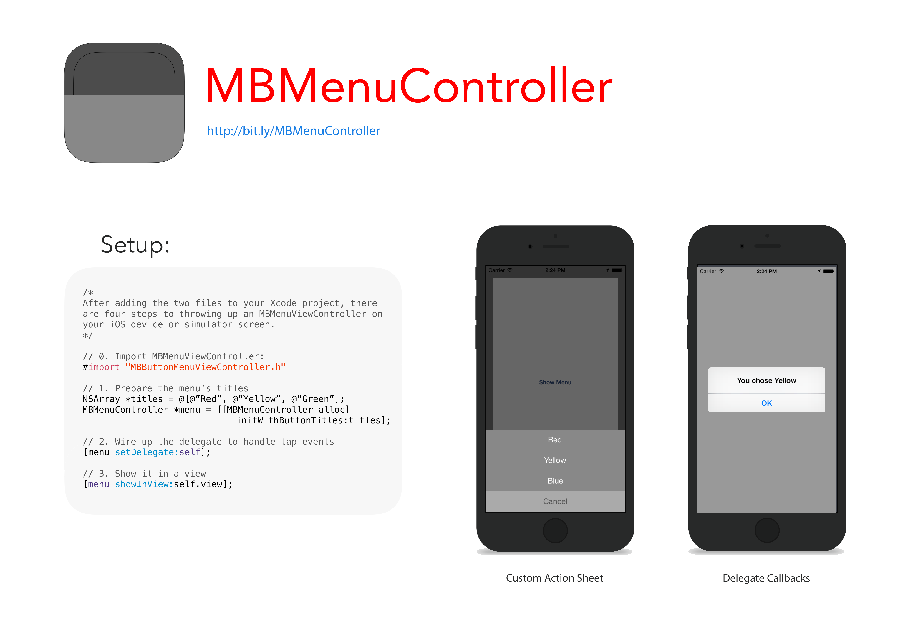

MBMenuController
================

Description:
------------

MBMenuController is similar to UIActionSheet. It's something I rolled for a project I  was working on.

Getting Started:
---------------

**With CocoaPods:**

`pod 'MBMenuController', '~>2.0.2'

**Without CocoaPods:**

Grab `MBMenuController.h/m` from `MBMenuController/Button Menu/` and add them to your project. (The delegate protocol is declared in the header.)

Dependencies:
-------------

You'll need the iOS 7 SDK. I haven't tested against earlier versions of iOS, but in theory, this should work with prior versions. 

MBButtonMenuController links against CoreGraphics.framework and UIKit.framework, but you shouldn't have to add them to your projects. Xcode will have done that for you.

Showing an MBBMenuController:
--------------------------------------

    /*
 
      After adding the two files to your Xcode project, 
      there are four steps to throwing up an 
      MBMenuController on the screen.
    
    */

    // 0. Import MBMenuController.h
    #import "MBMenuController.h"

    // 1. Instantiate an instance with an array of titles
    NSArray *titles = @[@"Red", @"Yellow", @"Green"];
    MBMenuController *menu = [[MBMenuController alloc] initWithButtonTitles:titles];
    
    // 2. Wire up the delegate, to handle tap events
    [menu setDelegate:self];

    // 3. Show it in a view
    [menu showInView:[self view]];

Handling Button Taps:
---------------------

There's a simple delegate API defined in MBMenuController.h. It contains two methods, modeled after `UIActionSheet`. They are:

    buttonMenuViewController:buttonTappedAtIndex:
    buttonMenuViewControllerDidCancel:

When a button is tapped, the MBMenuController first checks for the cancel button, and then fires `buttonMenuViewController:buttonTappedAtIndex:` if the button wasn't the cancel button. In either case, the delegate has the opportunity to properly handle the event. The simplest implementation would be to dismiss the menu.

Dismissing the Menu:
--------------------
Dismissing the menu is really simple. Just use this one liner:
          
  [`[menu hide];`](https://github.com/MosheBerman/MBMenuController/blob/master/MBMenuController/Button%20Menu/MBMenuController.h#L29)

Optional API:
-------------

**Background Color:** You can set the color of the MBMenuController by calling `setBackgroundColor:` and passing in a UIColor. This color is also used for the cancel button text. Calling this does *not* cause the menu to render itself again, so it must be called before set button titles. (Issue #4.)

**Cancel Button Index:** You can tell the MBMenuController which button to treat as the cancel button by passing an NSUInteger to [`setCancelButtonIndex:`](https://github.com/MosheBerman/MBMenuController/blob/master/MBMenuController/Button%20Menu/MBMenuController.m#L131). If the index is out of range, nothing happens. Passing an index that is between zero and the bounds of the button titles array will cause the index to be set and the menu to update. 

How it works:
-------------

You initialize an instance of `MBMenuController` with an array of button titles, but you can set them later if you'd like. Calling [`setButtonTitles:`](https://github.com/MosheBerman/MBMenuController/blob/master/MBMenuController/Button%20Menu/MBMenuController.m#L125) will cause the menu to render itself again. `MBMenuController` handles situations where there are too many buttons by using a scroll view. When there are too many buttons to squeeze down, the menu scrolls. 
To handle tap events, MBMenuController employs a simple delegate, which contains two methods, as described above. 

When it is shown, the menu causes the "parent" view to shrink. To achieve this, MBButtonMenuController applies a transform to the view it's being shown "in" and installs itself above the target view, to provide the intended effect.

License:
========

MBButtonMenuController is hereby released under the MIT License. 

Copyright (c) 2013-2015 Moshe Berman

Permission is hereby granted, free of charge, to any person obtaining a copy of this software and associated documentation files (the "Software"), to deal in the Software without restriction, including without limitation the rights to use, copy, modify, merge, publish, distribute, sublicense, and/or sell copies of the Software, and to permit persons to whom the Software is furnished to do so, subject to the following conditions:

The above copyright notice and this permission notice shall be included in all copies or substantial portions of the Software.

THE SOFTWARE IS PROVIDED "AS IS", WITHOUT WARRANTY OF ANY KIND, EXPRESS OR IMPLIED, INCLUDING BUT NOT LIMITED TO THE WARRANTIES OF MERCHANTABILITY, FITNESS FOR A PARTICULAR PURPOSE AND NONINFRINGEMENT. IN NO EVENT SHALL THE AUTHORS OR COPYRIGHT HOLDERS BE LIABLE FOR ANY CLAIM, DAMAGES OR OTHER LIABILITY, WHETHER IN AN ACTION OF CONTRACT, TORT OR OTHERWISE, ARISING FROM, OUT OF OR IN CONNECTION WITH THE SOFTWARE OR THE USE OR OTHER DEALINGS IN THE SOFTWARE.
